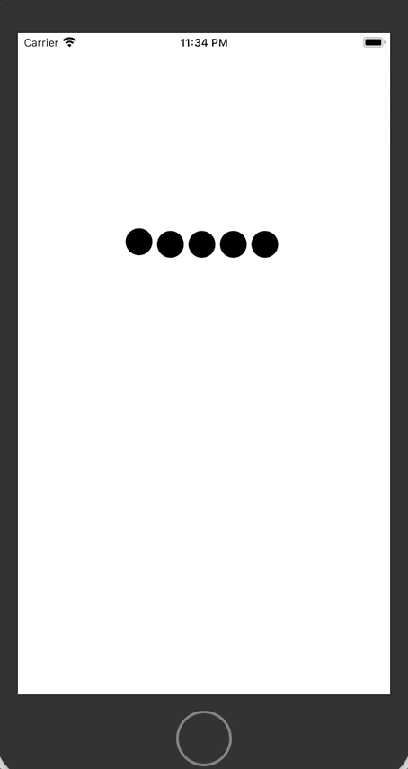
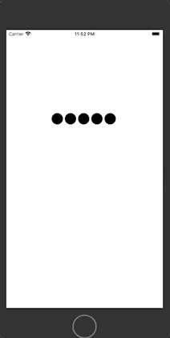
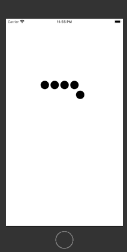
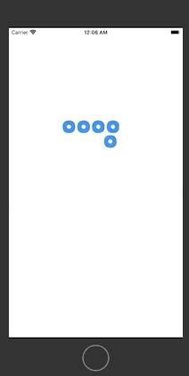
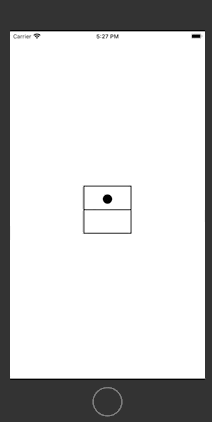
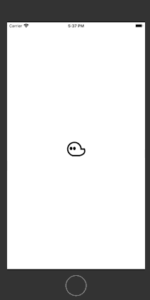
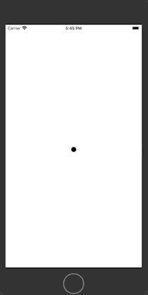
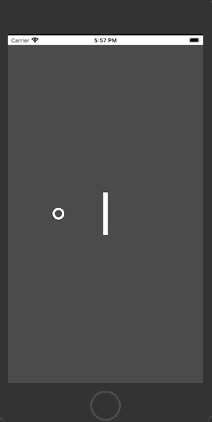
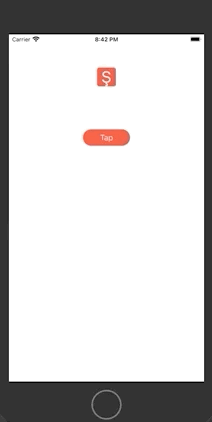

# Bunimation

> An animation library implemented with SwiftUI. 

## Buniball

> Buniball is a loading indicator. You can give your customized view, size, count (you need more than one), space between customized views, animation time and available movements which is up, down or both. 

### Usage

```swift
    init(animationTime: Double = 1, ballCount: Int = 6,
        ballSize: CGSize = CGSize(width: 24, height: 24),
        space: CGFloat = 8, 
        availableMovement: (up: Bool, down: Bool) = (true, true), 
        @ViewBuilder view: () -> AnimatedView)
```
### Examples

```swift
    Buniball(animationTime: 1, ballCount: 5, 
            ballSize: CGSize(width: 30, height: 30), 
            space: 5, availableMovement: (true, false)) {
            Circle()
        }
```


> Try avaliableMovement as (true, true)
```swift
    Buniball(animationTime: 1, ballCount: 5, 
            ballSize: CGSize(width: 30, height: 30), 
            space: 5, availableMovement: (true, true)) {
            Circle()
        }
```



> Try avaliableMovement as (false, true)
```swift
    Buniball(animationTime: 1, ballCount: 5, 
            ballSize: CGSize(width: 30, height: 30), 
            space: 5, availableMovement: (false, true)) {
            Circle()
        }
```



> Let's change animation view as below

```swift
ZStack {
    Capsule(style: .continuous)
        .foregroundColor(.accentColor)
    Capsule()
        .frame(width: 10, height: 10)
        .foregroundColor(.white)
}
```



## Bunibfall




## BuniCasper

> A ghost winked. 
    
### Example

```swift
BuniCasper()
```



## BuniClickedBall

> BuniClickedBall can use as loading indicator, button animation or something else. 

### Example

```swift
BuniClickedBall()
```



## BuniExplode

### Example

```swift
BuniExplode()
```



## BuniLetters

> You can show and hide your letters except the last one!

### BuniLettersViewModel

> This is the main object that manage this amazing animation. It has four published variables which are letters, interval, specialCharacterBackgroundColor and characterBackgroundColor.

**Interval** is the duration of state change from show to hide or vice versa.
**Letters** are shown. 
**specialCharacterBackgroundColor** is the background color of the last char.
**characterBackgroundColor** is the bacground color of chars except the last one.

#### Usage

```swift
init(text: String, interval: Double, specialCharacterBackgroundColor: Color, characterBackgroundColor: Color)
```

Text will parse and set to letters.

### ShouldShow

> ShouldShow is a bound parameter which you can change state of BuniLetters.

### BuniLetters Usage

```swift
init(viewModel: BuniLettersViewModel, shouldShow: Binding<Bool>)
```

### Example

```swift
@State var shouldShow: Bool = false

BuniLetters(viewModel: BuniLettersViewModel(text: "Barış", interval: 0.6, specialCharacterBackgroundColor: .red, characterBackgroundColor: .blue), shouldShow: $shouldShow)
```



